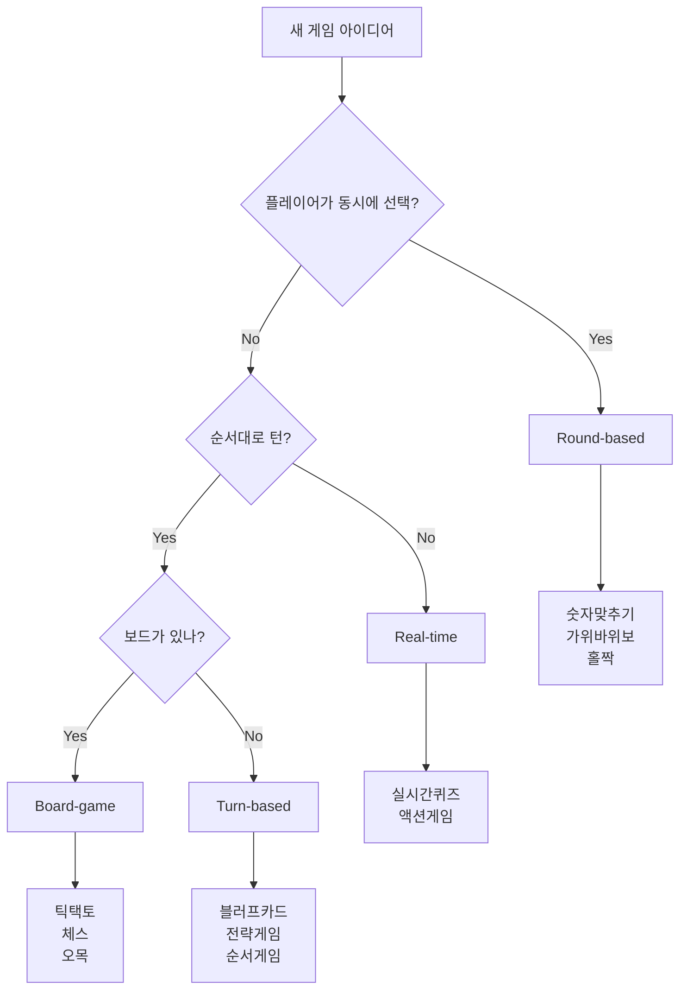

# AI를 위한 게임 개발 아키텍처 가이드

> 🚀 **2025년 리팩토링 완료**: 이 문서는 2025년 1월에 완료된 대규모 아키텍처 리팩토링을 기반으로 작성되었습니다. 새로운 확장 가능한 게임 시스템의 설계 의도와 사용법을 설명합니다.

## 📋 목차

1. [리팩토링 개요](#리팩토링-개요)
2. [새로운 아키텍처 이해](#새로운-아키텍처-이해)
3. [게임 카테고리 시스템](#게임-카테고리-시스템)
4. [개발 워크플로우](#개발-워크플로우)
5. [코드 생성 및 템플릿](#코드-생성-및-템플릿)
6. [확장성 고려사항](#확장성-고려사항)
7. [디버깅 및 유지보수](#디버깅-및-유지보수)

## 🚀 리팩토링 개요

### 🎯 리팩토링 목표

**이전**: 간단한 라운드 기반 게임만 지원 (숫자 맞추기, 홀짝)
**현재**: 복잡한 게임까지 체계적으로 지원 (체스, 블러핑, 실시간 게임)

### ✨ 주요 개선사항

1. **카테고리 기반 게임 아키텍처**
   - Round-based, Turn-based, Board, Real-time 게임 지원
   - 각 카테고리별 전용 베이스 클래스와 인터페이스

2. **강화된 타입 시스템**
   - 제네릭 기반 타입 안전성
   - 카테고리별 특화된 타입 정의
   - 컴파일 타임 에러 방지

3. **게임 팩토리 패턴**
   - 동적 게임 등록 및 발견
   - 메타데이터 기반 게임 관리
   - 자동 검증 및 생성

4. **메시지 시스템 개선**
   - 타입 안전한 WebSocket 메시지
   - MessageBuilder를 통한 일관된 메시지 생성
   - 게임별 특화 메시지 타입

5. **React 컴포넌트 상속 패턴**
   - 카테고리별 베이스 컴포넌트 클래스
   - 재사용 가능한 UI 패턴
   - 일관된 게임 UI 구조

## 🏗️ 새로운 아키텍처 이해

### 📁 핵심 파일 구조

```
shared/games/base/
├── game-types.ts           # 핵심 타입 시스템
├── game-interfaces.ts      # 게임 인터페이스 정의
├── game-factory.ts         # 팩토리 패턴 구현
├── game-generator.ts       # 자동 코드 생성
├── message-types.ts        # 메시지 시스템
├── base-game-handler.ts    # 라운드 기반 베이스
├── turn-based-game-handler.ts  # 턴 기반 베이스
└── board-game-handler.ts   # 보드 게임 베이스

client/src/components/game-play/common/
└── base-game-component.tsx # React 컴포넌트 베이스
```

### 🎯 핵심 설계 철학

#### 1. **카테고리 우선 설계**
```typescript
// 게임 카테고리별로 다른 베이스 클래스 사용
export type GameCategory = 'round-based' | 'turn-based' | 'board-game' | 'real-time';

// 카테고리에 따른 상태 타입 자동 결정
type GameStateMap = {
  'round-based': RoundBasedGameState;
  'turn-based': TurnBasedGameState;
  'board-game': BoardGameState;
  'real-time': RealTimeGameState;
};
```

#### 2. **제네릭 기반 타입 안전성**
```typescript
// 모든 게임 인터페이스는 제네릭으로 타입 안전성 보장
export interface IGame<
  TCategory extends GameCategory = GameCategory,
  TState extends GameStateMap[TCategory] = GameStateMap[TCategory],
  TAction extends GameActionMap[TCategory] = GameActionMap[TCategory]
> {
  // 카테고리에 맞는 타입들이 자동으로 결정됨
}
```

#### 3. **합성을 통한 확장성**
```typescript
// 인터페이스 조합으로 복잡한 게임 타입 생성
export interface ComplexGameHandlers<TState, TAction> 
  extends RoundGameHandlers<TState, TAction>,
          TurnGameHandlers<TState, TAction>,
          BoardGameHandlers<TState, TAction> {
  // 여러 게임 패턴을 조합한 복잡한 게임 지원
}
```

## 🎮 게임 카테고리 시스템

### 🎯 라운드 기반 게임 (Round-based)

**특징**: 여러 라운드, 점수제, 동시 선택
**예시**: 숫자 맞추기, 홀짝, 가위바위보
**베이스**: `BaseGameHandler`

```typescript
// 상태 구조
interface RoundBasedGameState extends CoreGameState {
  currentRound: number;
  maxRounds: number;
  playerScores: Record<string, number>;
  playerChoices: Record<string, any>;
}

// 핸들러 구현
export class MyRoundGameHandler extends BaseGameHandler<
  MyGameState,
  MyChoiceMessage,
  MyChoice,
  MyRound
> {
  // 라운드별 로직 구현
}
```

### 🎲 턴 기반 게임 (Turn-based)

**특징**: 순차적 턴, 게임 히스토리, 이동 검증
**예시**: 블러프 카드, 전략 게임
**베이스**: `BaseTurnGameHandler`

```typescript
// 상태 구조  
interface TurnBasedGameState extends CoreGameState {
  currentPlayer: string;
  turnCount: number;
  gameHistory: GameMove[];
}

// 핸들러 구현
export class MyTurnGameHandler extends BaseTurnGameHandler<
  MyGameState,
  MyMove
> {
  // 턴 관리 로직 구현
}
```

### 🏁 보드 게임 (Board-game)

**특징**: 격자 보드, 위치 기반 이동, 승리 조건
**예시**: 틱택토, 체스, 오목
**베이스**: `BaseBoardGameHandler`

```typescript
// 상태 구조
interface BoardGameState extends TurnBasedGameState {
  board: any[][];
  boardSize: { width: number; height: number };
}

// 핸들러 구현
export class MyBoardGameHandler extends BaseBoardGameHandler<
  MyGameState,
  MyMove
> {
  // 보드 관리 로직 구현
}
```

### ⚡ 실시간 게임 (Real-time)

**특징**: 실시간 상호작용, 타이머, 즉시 반응
**예시**: 실시간 퀴즈, 액션 게임
**베이스**: `BaseRealTimeGameHandler` (향후 구현)

## 🛠️ 개발 워크플로우

### 1단계: 게임 카테고리 결정

**🤔 어떤 카테고리인가요?**



### 2단계: GameGenerator 활용

**🎯 자동 코드 생성 시스템 사용**

```typescript
// 게임 생성 옵션 정의
const gameOptions: GameGenerationOptions = {
  gameId: 'rock-paper-scissors',
  gameName: '가위바위보',
  category: 'round-based',
  description: '가위, 바위, 보 중 하나를 선택하세요!',
  
  // 게임별 설정
  choices: ['rock', 'paper', 'scissors'],
  maxPlayers: 6,
  maxRounds: 3,
  
  // 생성할 파일들
  generateFiles: ['schema', 'handler', 'component']
};

// 자동 생성
const gameFactory = GameFactoryImpl.getInstance();
const generator = new GameGenerator();
const result = await generator.generateGame(gameOptions, 'round-based-template');
```

### 3단계: 생성된 코드 커스터마이징

**🔧 게임별 로직 구현**

```typescript
// 생성된 핸들러를 게임 로직에 맞게 수정
export class RockPaperScissorsHandler extends BaseGameHandler<...> {
  
  // 승부 판정 로직 오버라이드
  protected processRound(game: RockPaperScissorsGameState): Promise<void> {
    // 가위바위보 승부 로직 구현
    const results = this.determineWinners(game.playerChoices);
    // ...
  }
  
  private determineWinners(choices: Record<string, RPSChoice>): string[] {
    // 가위바위보 승부 판정 로직
  }
}
```

### 4단계: 등록 및 통합

**📝 시스템 등록**

```typescript
// 1. 서버 게임 팩토리 등록
gameFactory.registerGame('rock-paper-scissors', RockPaperScissorsHandler, {
  category: 'round-based',
  name: '가위바위보',
  description: '가위, 바위, 보 중 하나를 선택하세요!',
  minPlayers: 2,
  maxPlayers: 6,
  difficulty: 'easy',
  tags: ['popular', 'quick']
});

// 2. 클라이언트 게임 매니저 등록  
gameManager.registerGameComponent('rock-paper-scissors', RockPaperScissorsGame);

// 3. 메시지 타입 등록
messageRegistry.registerMessageType('rps_choice', {
  validate: (data) => ['rock', 'paper', 'scissors'].includes(data.choice)
});

// 4. CreateRoomModal 업데이트
// - client/src/components/create-room-modal.tsx에서:
// - gameType 타입에 새 게임 추가
// - SelectContent에 새 게임 선택지 추가
// - 필요시 특별한 플레이어 수 제한 로직 추가
```

## 🏭 코드 생성 및 템플릿

### 🎯 GameGenerator 상세 활용법

#### 템플릿 시스템

```typescript
// 사용 가능한 템플릿들
const templates = {
  'round-based-template': '라운드 기반 게임 템플릿',
  'turn-based-template': '턴 기반 게임 템플릿', 
  'board-game-template': '보드 게임 템플릿',
  'complex-game-template': '복잡한 게임 템플릿'
};

// 템플릿별 생성 파일
const templateFiles = {
  'round-based-template': [
    'schema.ts',          // 게임 상태 및 타입 정의
    'handler.ts',         // 서버 로직
    'component.tsx',      // React 컴포넌트
    'config.ts'           // 게임 설정
  ],
  'board-game-template': [
    'schema.ts',
    'handler.ts', 
    'component.tsx',
    'board-component.tsx', // 보드 전용 컴포넌트
    'config.ts'
  ]
};
```

#### 생성 옵션 세부 설정

```typescript
interface GameGenerationOptions {
  // 기본 정보
  gameId: string;           // 'rock-paper-scissors'
  gameName: string;         // '가위바위보'
  category: GameCategory;   // 'round-based'
  description: string;      // 게임 설명
  
  // 게임 설정
  choices?: string[];       // ['rock', 'paper', 'scissors']
  maxPlayers: number;       // 6
  minPlayers?: number;      // 2
  maxRounds?: number;       // 3 (라운드 기반만)
  boardSize?: { width: number; height: number }; // 보드 게임만
  
  // 생성 옵션
  generateFiles: ('schema' | 'handler' | 'component' | 'tests')[];
  customFields?: Record<string, any>;  // 추가 필드
  
  // UI 설정
  useIcons?: boolean;       // 아이콘 사용 여부
  colorScheme?: string;     // 색상 테마
}
```

### 🎨 컴포넌트 생성 패턴

#### 베이스 컴포넌트 활용

```typescript
// 자동 생성되는 컴포넌트 구조
export class RockPaperScissorsGame extends RoundBasedGameComponent<
  RockPaperScissorsGameProps,
  RockPaperScissorsGameState
> {
  
  // 게임별 초기 상태
  protected getInitialState(): RockPaperScissorsGameState {
    return {
      ...this.getInitialBaseState(),
      selectedChoice: null,
      animationState: 'idle'
    };
  }
  
  // 게임 보드 렌더링
  protected renderGameBoard(): React.ReactNode {
    return (
      <div className="rps-game-board">
        {this.renderChoiceButtons()}
        {this.renderPlayerChoices()}
        {this.renderResults()}
      </div>
    );
  }
  
  // 액션 영역 렌더링  
  protected renderActionArea(): React.ReactNode {
    return this.renderChoiceButtons();
  }
  
  // 게임 상태 표시
  protected getGameSpecificStatus(): React.ReactNode {
    return this.renderScoreBoard(); // 베이스에서 제공
  }
}
```

## 🔧 확장성 고려사항

### 🎯 향후 확장 가능한 영역

#### 1. 새로운 게임 카테고리 추가

```typescript
// 새 카테고리 정의
export type GameCategory = 
  | 'round-based' 
  | 'turn-based' 
  | 'board-game' 
  | 'real-time'
  | 'cooperative'    // 새 카테고리: 협력 게임
  | 'party'          // 새 카테고리: 파티 게임
  | 'puzzle';        // 새 카테고리: 퍼즐 게임

// 새 카테고리별 상태 타입
interface CooperativeGameState extends CoreGameState {
  teamGoals: TeamGoal[];
  sharedResources: Resource[];
  cooperationLevel: number;
}

// 새 베이스 핸들러
export abstract class BaseCooperativeGameHandler<TState, TAction> 
  extends BaseGameHandler<TState, TAction> {
  // 협력 게임 전용 로직
}
```

#### 2. AI 에이전트 통합

```typescript
// AI 플레이어 지원
interface AIPlayerConfig {
  difficulty: 'easy' | 'medium' | 'hard';
  personality: 'aggressive' | 'defensive' | 'random';
  learningEnabled: boolean;
}

interface GameStateWithAI extends CoreGameState {
  aiPlayers: Record<string, AIPlayerConfig>;
  aiMoves: Record<string, any[]>;
}

// AI 핸들러 인터페이스
interface AIGameHandler<TState, TMove> {
  generateAIMove(gameState: TState, aiPlayerId: string): Promise<TMove>;
  updateAIStrategy(gameState: TState, results: GameResult[]): void;
}
```

#### 3. 플러그인 시스템

```typescript
// 게임 플러그인 인터페이스
interface GamePlugin {
  id: string;
  name: string;
  version: string;
  
  // 게임 로직 확장
  extendHandler?(handler: any): any;
  extendState?(state: any): any;
  
  // UI 확장
  extendComponent?(component: any): any;
  customTheme?: ThemeConfig;
  
  // 설정
  configSchema?: any;
  defaultConfig?: any;
}

// 플러그인 시스템
class GamePluginSystem {
  private plugins = new Map<string, GamePlugin>();
  
  registerPlugin(plugin: GamePlugin): void {
    this.plugins.set(plugin.id, plugin);
  }
  
  applyPlugins(gameId: string, target: any): any {
    // 플러그인 적용 로직
  }
}
```

### 🔄 마이그레이션 및 호환성

#### 기존 게임 자동 마이그레이션

```typescript
// 마이그레이션 도구
class GameMigrator {
  async migrateToNewArchitecture(oldGameConfig: any): Promise<GameGenerationOptions> {
    // 기존 게임을 새 아키텍처로 자동 변환
    return {
      gameId: oldGameConfig.type,
      gameName: oldGameConfig.name,
      category: this.detectCategory(oldGameConfig),
      // ... 자동 변환 로직
    };
  }
  
  private detectCategory(config: any): GameCategory {
    // 기존 게임의 특성을 분석하여 카테고리 자동 결정
    if (config.hasRounds) return 'round-based';
    if (config.hasBoard) return 'board-game';
    if (config.hasTurns) return 'turn-based';
    return 'round-based'; // 기본값
  }
}
```

## 🐛 디버깅 및 유지보수

### 🔍 디버깅 도구

#### 1. 게임 상태 인스펙터

```typescript
// 개발 모드 디버깅 도구
class GameStateInspector {
  static inspect(gameState: CoreGameState): GameStateReport {
    return {
      basicInfo: {
        gameType: gameState.gameType,
        category: gameState.category,
        status: gameState.gameStatus,
        players: gameState.playerIds.length
      },
      stateHealth: {
        hasValidPlayers: gameState.playerIds.length > 0,
        hasValidTimestamps: gameState.createdAt && gameState.lastUpdated,
        disconnectedCount: gameState.disconnectedPlayers?.length || 0
      },
      warnings: this.detectWarnings(gameState),
      errors: this.detectErrors(gameState)
    };
  }
  
  private static detectWarnings(state: CoreGameState): string[] {
    const warnings = [];
    if (state.disconnectedPlayers?.length > 0) {
      warnings.push(`${state.disconnectedPlayers.length}명의 플레이어가 연결 해제됨`);
    }
    return warnings;
  }
}
```

#### 2. 성능 모니터링

```typescript
// 게임 성능 모니터
class GamePerformanceMonitor {
  private metrics = new Map<string, PerformanceMetric>();
  
  trackGameAction(gameId: string, action: string, duration: number): void {
    const key = `${gameId}:${action}`;
    if (!this.metrics.has(key)) {
      this.metrics.set(key, {
        count: 0,
        totalDuration: 0,
        maxDuration: 0,
        minDuration: Infinity
      });
    }
    
    const metric = this.metrics.get(key)!;
    metric.count++;
    metric.totalDuration += duration;
    metric.maxDuration = Math.max(metric.maxDuration, duration);
    metric.minDuration = Math.min(metric.minDuration, duration);
  }
  
  getReport(gameId: string): PerformanceReport {
    // 성능 리포트 생성
  }
}
```

### 🛠️ 유지보수 가이드라인

#### 1. 코드 컨벤션

```typescript
// 파일 네이밍 규칙
/*
게임 ID: kebab-case       (rock-paper-scissors)
클래스명: PascalCase      (RockPaperScissorsHandler)  
인터페이스: PascalCase    (RockPaperScissorsGameState)
상수: UPPER_SNAKE_CASE   (ROCK_PAPER_SCISSORS_CONFIG)
파일명: kebab-case.ts    (rock-paper-scissors.ts)
*/

// 주석 규칙
/**
 * 게임 핸들러 클래스
 * @category Round-based
 * @complexity Low
 * @players 2-6
 */
export class RockPaperScissorsHandler {
  /**
   * 승부 판정 로직
   * @param choices 플레이어별 선택지
   * @returns 승자 목록
   */
  private determineWinners(choices: Record<string, RPSChoice>): string[] {
    // 구현...
  }
}
```

#### 2. 테스트 전략

```typescript
// 게임별 테스트 패턴
describe('RockPaperScissorsHandler', () => {
  let handler: RockPaperScissorsHandler;
  let mockStorage: MockStorage;
  let mockBroadcast: jest.Mock;
  
  // 카테고리별 공통 테스트
  describe('Round-based Game Tests', () => {
    it('should initialize game state correctly', () => {
      // 라운드 기반 게임 공통 테스트
    });
    
    it('should handle player choices', () => {
      // 선택 처리 테스트
    });
  });
  
  // 게임별 특수 테스트
  describe('Rock Paper Scissors Logic', () => {
    it('should determine winner correctly', () => {
      // 가위바위보 승부 판정 테스트
    });
    
    it('should handle ties', () => {
      // 무승부 처리 테스트  
    });
  });
});
```

#### 3. 에러 처리 패턴

```typescript
// 계층별 에러 처리
class GameErrorHandler {
  static handle(error: Error, context: GameContext): GameErrorResponse {
    // 에러 타입별 처리
    if (error instanceof ValidationError) {
      return { type: 'validation', message: error.message, recoverable: true };
    }
    
    if (error instanceof GameStateError) {
      return { type: 'state', message: error.message, recoverable: false };
    }
    
    // 예상치 못한 에러
    console.error('Unexpected game error:', error, context);
    return { type: 'unknown', message: 'Game error occurred', recoverable: false };
  }
}
```

## 🎯 AI 에이전트를 위한 핵심 가이드

### 💡 개발 시 반드시 기억할 점

#### 1. **카테고리 우선 접근**
- 새 게임 개발 시 먼저 카테고리를 정확히 결정
- 카테고리에 맞는 베이스 클래스와 인터페이스 사용
- 카테고리 간 혼용 금지

#### 2. **GameGenerator 활용**
- 수동 코딩보다 GameGenerator 우선 사용
- 템플릿을 통한 일관된 코드 생성
- 생성 후 게임별 로직만 커스터마이징

#### 3. **타입 안전성 준수**
- 모든 제네릭 타입 매개변수 명시
- 컴파일 타임 에러 완전 해결 후 커밋
- any 타입 사용 최소화

#### 4. **등록 시스템 완료**
- 서버/클라이언트 양쪽 모두 등록
- 메시지 타입 등록 및 검증 함수 구현
- 모든 등록 완료 후 테스트

#### 5. **연결 관리 활용**
- 베이스 클래스의 연결 관리 시스템 신뢰
- 게임별 특수 처리만 오버라이드
- disconnectedPlayers 배열 상태 확인

### 🚀 성공적인 게임 개발을 위한 체크리스트

- [ ] 게임 카테고리 정확히 결정
- [ ] GameGenerator로 기본 구조 생성
- [ ] 게임별 로직 구현 및 테스트
- [ ] 서버/클라이언트 등록 완료
- [ ] 메시지 타입 등록 및 검증
- [ ] **✅ 연결 관리 자동 제공됨 (모든 베이스 클래스)**
- [ ] 타입 에러 완전 해결
- [ ] 연결 관리 테스트 완료 (연결 해제/재연결/나가기)
- [ ] UI/UX 최적화
- [ ] 성능 및 메모리 누수 검증
- [ ] 문서화 및 주석 작성

### 🔧 기존 게임 리팩토링 체크리스트

- [ ] 현재 게임의 실제 로직 분석
- [ ] 적절한 베이스 클래스 선택 (카테고리 기반)
- [ ] 불필요한 코드 제거 (잘못된 베이스 클래스의 메서드들)
- [ ] 게임별 특화 로직 유지
- [ ] 타입 시스템 일관성 확인
- [ ] 테스트 및 검증

---

> 📚 **참고 문서**: 
> - [기존 AI 게임 생성 가이드](./AI_GAME_CREATION_GUIDE.md) - 상세 템플릿 및 예시
> - [게임 개발 가이드](./GAME_DEVELOPMENT_GUIDE.md) - 기본 개발 프로세스
> - `CLAUDE.md` - 프로젝트 전체 아키텍처 이해

> 🎯 **최종 목표**: AI가 이 가이드를 통해 복잡하고 확장 가능한 게임을 체계적으로 개발할 수 있도록 지원